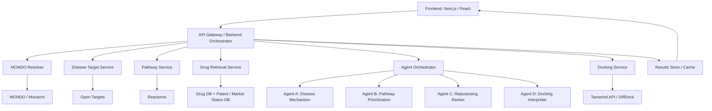
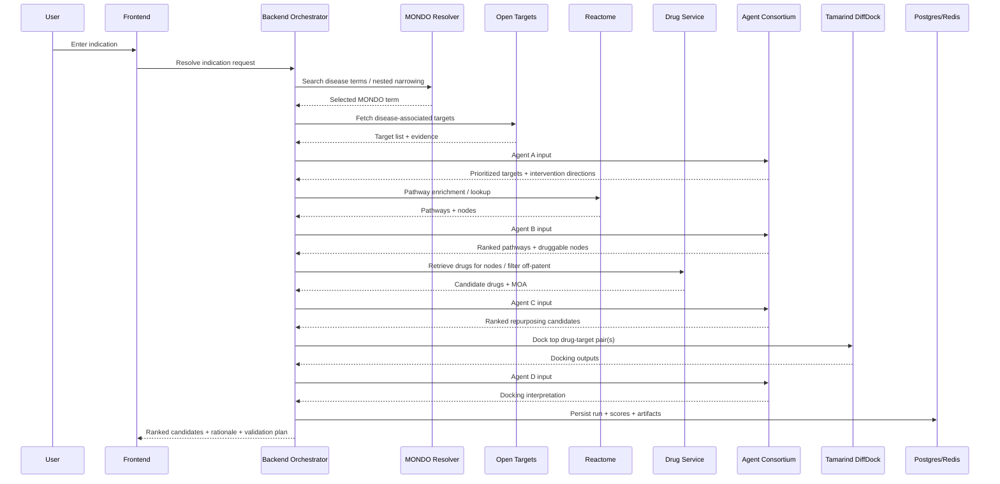

# YC Biohack Hackathon Plan — Indication-First Drug Repurposing Consortium

## 1) Objective

Build an indication-first drug repurposing system that:

1. Resolves a user-entered disease/indication into a precise ontology term.
2. Retrieves disease-associated genes/targets.
3. Expands those into pathway-level intervention opportunities.
4. Retrieves existing approved/off-patent drugs that modulate those pathway nodes.
5. Uses a consortium of reasoning agents only at the biological decision intersections.
6. Optionally validates top drug–target hypotheses with docking.
7. Produces a ranked shortlist of repurposable drugs for the input indication.

Core product thesis:

> Given an indication, identify the most plausible existing drugs to repurpose by reasoning over disease biology, pathways, mechanism of action, and structural plausibility.

---

## 2) Product Scope

### In scope

* Indication-first workflow
* MONDO-based disease narrowing
* Disease-associated target retrieval
* Pathway enrichment and pathway-neighbor expansion
* Drug retrieval over direct and pathway-adjacent nodes
* Off-patent / mature-drug filtering
* Agent consortium at biological intersections
* Docking for top shortlisted drug–target pairs
* Ranked output with rationale and recommended validation assays

### Out of scope for MVP

* Full global patent adjudication
* Massive all-drug screening
* Fully autonomous open-ended agent loops
* Wet-lab execution integration
* RFdiffusion in main workflow

---

## 3) User Story

A user enters an indication such as:

* idiopathic pulmonary fibrosis
* ulcerative colitis
* glioblastoma

The system narrows it to a precise MONDO term, maps relevant genes/targets and pathways, identifies existing drugs that hit those mechanisms, and ranks repurposing candidates with biological reasoning and optional docking support.

---

## 4) High-Level Architecture



---

## 5) Agent Consortium Design

### Principle

Use agents only at the intersections where biological interpretation is needed. Retrieval stays deterministic.

### Why a consortium

A consortium is more defensible than a single monolithic model because each agent owns one reasoning problem and hands structured outputs to the next. This reduces hallucination, improves traceability, and makes the final result easier to explain.

### Agent roster

#### Agent A — Disease Mechanism Agent

**Input:**

* MONDO-resolved indication
* disease-associated genes/targets
* target–disease evidence scores

**Job:**

* separate likely drivers from passengers/biomarkers
* infer desired direction of modulation (inhibit / activate / modulate)
* produce prioritized disease intervention points

**Output schema:**

```json
{
  "disease": {"label": "idiopathic pulmonary fibrosis", "mondo_id": "MONDO:..."},
  "prioritized_targets": [
    {
      "gene": "TGFB1",
      "role": "core profibrotic signaling",
      "desired_modulation": "inhibit",
      "confidence": 0.92,
      "why": "Strong evidence across disease biology and pathway centrality"
    }
  ]
}
```

#### Agent B — Pathway Prioritization Agent

**Input:**

* prioritized targets from Agent A
* pathway enrichment results
* pathway membership / neighbors / upstream-downstream relationships

**Job:**

* identify the most disease-relevant pathways
* determine which nodes are actionable vs too downstream / too generic
* produce ranked druggable nodes

**Output schema:**

```json
{
  "ranked_pathways": [
    {
      "name": "Signaling by TGF-beta receptor complex",
      "source": "Reactome",
      "relevance_score": 0.94,
      "druggable_nodes": ["TGFBR1", "TGFBR2", "SMAD3"],
      "why": "Central to fibrotic remodeling"
    }
  ]
}
```

#### Agent C — Repurposing Ranker

**Input:**

* indication summary
* prioritized targets
* ranked pathways
* pathway nodes
* drug candidates
* drug target + action + known indications + off-patent status

**Job:**

* rank candidate drugs
* verify directionality fit between disease mechanism and drug action
* explain repurposing rationale
* surface risk flags and novelty

**Output schema:**

```json
{
  "candidates": [
    {
      "drug": "ExampleDrug",
      "target": "TGFBR1",
      "action": "inhibitor",
      "repurposing_score": 0.84,
      "novelty_score": 0.63,
      "risk_flags": ["Pathway pleiotropy"],
      "why": "Mechanistically aligned with profibrotic pathway inhibition"
    }
  ]
}
```

#### Agent D — Docking Interpreter

**Input:**

* selected drug–target pair(s)
* docking outputs
* disease/pathway context

**Job:**

* interpret docking as structural plausibility, not proof of efficacy
* downgrade or upgrade confidence
* summarize what can and cannot be concluded

**Output schema:**

```json
{
  "drug_target_pair": {"drug": "ExampleDrug", "target": "TGFBR1"},
  "structural_assessment": "supportive",
  "confidence_adjustment": 0.07,
  "limitations": ["Docking is not cellular validation"],
  "why": "Pose and confidence are directionally supportive"
}
```

### Consortium interaction protocol

1. Agent A produces disease intervention points.
2. Agent B critiques and expands them at the pathway layer.
3. Agent C consumes both and proposes ranked repurposing candidates.
4. Agent D updates the top candidate ranking using docking results.
5. A final summarizer composes the user-facing answer from structured outputs only.

### Multi-agent discussion pattern

Use a bounded two-round deliberation:

* Round 1: each agent independently produces JSON.
* Round 2: each agent sees the prior structured outputs and can revise only its own section.
* No free-form open-ended looping.

This preserves the “consortium” feel while keeping runtime and costs bounded.

---

## 6) Recommended Tech Stack

### Frontend

* **Next.js + React + TypeScript**
* **Tailwind CSS**
* **shadcn/ui** for fast polished components
* **Recharts** or simple charting for ranking visualizations

### Backend / API layer

* **Python FastAPI** for orchestration and data APIs
* Alternatively **Next.js API routes** for lightweight endpoints, but FastAPI is better for scientific/data workflows

### Async / workflow orchestration

* **Modal** for scalable GPU/compute jobs, async workers, and any heavier docking-related execution or batch preprocessing. Modal supports serverless GPU workloads, batch jobs, and ephemeral compute. ([modal.com](https://modal.com/docs?utm_source=chatgpt.com))
* Lightweight in-process task queue for MVP, or Redis-backed queue if needed

### LLM / agent layer

* **Anthropic Claude Opus 4.6** for the high-value synthesis steps in Agent B and Agent C. Anthropic describes Opus 4.6 as its most capable model, recommended for sophisticated agents and complex document creation. ([anthropic.com](https://www.anthropic.com/news/claude-opus-4-6?utm_source=chatgpt.com))
* **OpenAI GPT-5.4 via the Responses API** for structured extraction, formatting, and fallback reasoning; OpenAI’s current API docs list GPT-5.4 and the Responses API as core building blocks. ([platform.openai.com](https://platform.openai.com/docs/gpts/release-notes?utm_source=chatgpt.com))

### Datastores

* **Postgres** for normalized metadata and results
* **Redis** for caching query responses / transient state
* **Object storage** for artifacts such as docking result JSON or images

### Scientific / data sources

* **MONDO / Monarch** for disease ontology resolution
* **Open Targets GraphQL API** for target–disease associations; Open Targets supports GraphQL queries for diseases, drugs, targets, and associations. ([platform-docs.opentargets.org](https://platform-docs.opentargets.org/data-access/graphql-api?utm_source=chatgpt.com))
* **Reactome** for pathway enrichment and pathway content service
* **Drug database + patent/market-status source** for drug-target pairs and off-patent filtering
* **Tamarind API** for DiffDock inference

### Docking / structural layer

* Tamarind-hosted **DiffDock**
* Keep RFdiffusion as stretch / optional extension, not core workflow

### Observability

* Structured logs for every pipeline stage
* Prompt / output capture for each agent
* Score breakdown traceability
* Simple admin panel or debug JSON viewer

---

## 7) Systems Design Diagram



---

## 8) Data Flow

### Step 1: Disease resolution

* user enters free-text indication
* backend queries MONDO / Monarch
* frontend offers nested term refinement
* final output: canonical indication object

```json
{
  "user_query": "lung fibrosis",
  "resolved_term": {
    "label": "idiopathic pulmonary fibrosis",
    "mondo_id": "MONDO:...",
    "synonyms": ["IPF"],
    "parents": ["pulmonary fibrosis"]
  }
}
```

### Step 2: Disease target retrieval

* query Open Targets for target–disease associations
* normalize evidence scores and metadata
* pass top N targets to Agent A

### Step 3: Pathway expansion

* query Reactome using top targets
* get enriched pathways + member nodes
* pass top pathways and nodes to Agent B

### Step 4: Drug retrieval

* retrieve candidate drugs that hit direct targets or pathway-adjacent nodes
* filter to approved / public-data-rich / off-patent if possible
* pass curated candidates to Agent C

### Step 5: Docking

* run DiffDock on top K drug–target pairs
* pass docking output to Agent D

### Step 6: Final ranking

* combine:

  * disease-target evidence
    n  - pathway relevance
  * mechanism-direction fit
  * off-patent / maturity filter
  * docking support

---

## 9) Suggested Scoring Framework

Composite score for ranking repurposing candidates:

```text
Repurposing Score =
  0.30 * disease_target_relevance
+ 0.25 * pathway_intervention_fit
+ 0.20 * mechanism_directionality_fit
+ 0.15 * structural_plausibility
+ 0.10 * repurposability_score
```

Where:

* **disease_target_relevance** = evidence that the target matters in the disease
* **pathway_intervention_fit** = whether the node is a meaningful control point
* **mechanism_directionality_fit** = whether the drug’s action matches desired modulation
* **structural_plausibility** = docking support if run
* **repurposability_score** = off-patent / approved / public-data-rich / known safety profile

---

## 10) API Design

### Backend endpoints

#### `POST /resolve-indication`

Input:

```json
{"query": "lung fibrosis"}
```

Output:

```json
{
  "matches": [
    {"label": "pulmonary fibrosis", "mondo_id": "MONDO:..."},
    {"label": "idiopathic pulmonary fibrosis", "mondo_id": "MONDO:..."}
  ]
}
```

#### `POST /build-disease-context`

Input:

```json
{"mondo_id": "MONDO:..."}
```

Output:

```json
{
  "disease": {...},
  "targets": [...],
  "pathways": [...]
}
```

#### `POST /rank-candidates`

Input:

```json
{"mondo_id": "MONDO:...", "top_k": 20}
```

Output:

```json
{
  "candidates": [...],
  "score_breakdown": [...]
}
```

#### `POST /dock-candidate`

Input:

```json
{"drug": "ExampleDrug", "target": "TGFBR1"}
```

Output:

```json
{
  "status": "complete",
  "pose_url": "...",
  "confidence": 0.73
}
```

---

## 11) Data Model

### Table: `disease_runs`

* `id`
* `user_query`
* `mondo_id`
* `disease_label`
* `status`
* `created_at`

### Table: `targets`

* `id`
* `run_id`
* `gene_symbol`
* `source`
* `evidence_score`
* `desired_modulation`
* `agent_priority_score`
* `notes`

### Table: `pathways`

* `id`
* `run_id`
* `pathway_name`
* `source`
* `relevance_score`
* `druggable_nodes_json`
* `notes`

### Table: `candidate_drugs`

* `id`
* `run_id`
* `drug_name`
* `target`
* `action_type`
* `approved_status`
* `off_patent_flag`
* `known_indications_json`
* `repurposing_score`
* `score_breakdown_json`
* `rationale`

### Table: `docking_jobs`

* `id`
* `run_id`
* `drug_name`
* `target`
* `job_status`
* `confidence`
* `artifact_url`
* `interpretation_json`

---

## 12) Prompting Strategy

### Shared rules

* Every agent receives structured JSON inputs only.
* Every agent must return valid JSON matching its schema.
* Agents must separate “evidence-backed” from “hypothesis.”
* Agents must explicitly include uncertainty.

### Agent A prompt skeleton

```text
You are the Disease Mechanism Agent.
Given a resolved indication and disease-associated targets, identify the most likely intervention points.
Do not merely restate association scores.
Return only JSON.
```

### Agent B prompt skeleton

```text
You are the Pathway Prioritization Agent.
Given prioritized targets and pathway results, rank the pathways and identify the most actionable druggable nodes.
Prefer upstream or control-point nodes over generic downstream readouts.
Return only JSON.
```

### Agent C prompt skeleton

```text
You are the Drug Repurposing Agent.
Given the indication, disease intervention points, pathways, and candidate drugs, rank drugs for repurposing.
You must reason about directionality: whether the drug action aligns with the desired biological modulation.
Return only JSON.
```

### Agent D prompt skeleton

```text
You are the Docking Interpreter Agent.
Given docking outputs and biological context, assess whether the structural result is supportive, neutral, or contradictory.
Do not claim efficacy.
Return only JSON.
```

---

## 13) Execution Plan

### Phase 0 — Scope lock

* Pick one disease area for the live demo
* Choose 1–3 example indications
* Decide which drug DB / off-patent metadata source to use
* Decide whether docking is live or partially cached

### Phase 1 — Skeleton app

* Create Next.js frontend
* Create FastAPI backend
* Add `/resolve-indication`
* Add MONDO narrowing UI
* Add run state model

### Phase 2 — Disease and pathway pipeline

* Integrate Open Targets queries
* Integrate Reactome enrichment / lookup
* Normalize target/pathway payloads
* Store results in Postgres

### Phase 3 — Agent consortium

* Implement Agent A / B / C / D wrappers
* Add schema validation around agent outputs
* Add bounded two-round consortium flow
* Log prompts / outputs for debugging

### Phase 4 — Drug retrieval + scoring

* Build drug retrieval service
* Add off-patent filtering
* Add composite score calculation
* Create ranked candidate cards in UI

### Phase 5 — Docking integration

* Add Tamarind DiffDock call wrapper
* Persist results / artifacts
* Feed docking outputs into Agent D
* Show structural plausibility in UI

### Phase 6 — Demo polish

* Add progress states
* Add explanation cards
* Add “why this drug” and “next validation assay” sections
* Precompute 1–2 strong examples

---

## 14) Suggested Repo Structure

```text
repo/
  apps/
    web/
    api/
  packages/
    shared-types/
    prompts/
    scoring/
  services/
    mondo/
    open_targets/
    reactome/
    drugs/
    docking/
    agents/
  scripts/
    seed_data/
    preload_examples/
  docs/
    architecture.md
    prompts.md
    api_contracts.md
```

---

## 15) Demo Walkthrough

1. User types “lung fibrosis”.
2. App narrows to “idiopathic pulmonary fibrosis”.
3. Show top disease targets with intervention directions.
4. Show top enriched pathways and why they matter.
5. Show ranked repurposable drugs with mechanism cards.
6. Click one candidate to show docking-backed structural plausibility.
7. End with recommended validation assays.

This tells a complete story from disease to experiment.

---

## 16) Risks and Mitigations

### Risk: agents hallucinate biology

**Mitigation:** retrieval is deterministic; agents only reason on retrieved JSON.

### Risk: docking is overinterpreted

**Mitigation:** Agent D explicitly frames docking as plausibility, not proof.

### Risk: patent/off-patent status is noisy

**Mitigation:** keep “repurposable / mature / public-data-rich” as fallback language if exact off-patent resolution is incomplete.

### Risk: runtime too slow

**Mitigation:** cache MONDO, Open Targets, Reactome, and some docking outputs.

### Risk: too many candidates

**Mitigation:** cap candidates early and keep top N only.

---

## 17) Recommended Final Scope for the Hackathon

### Must-have

* indication input
* MONDO narrowing
* disease target retrieval
* pathway prioritization
* candidate drug ranking
* consortium reasoning
* polished UI

### Nice-to-have

* live docking for top 1–2 candidates
* downloadable report
* alternative disease branches

### Stretch

* literature evidence grounding
* interactive network graph
* RFdiffusion “next-step” extension

---

## 18) Final Pitch

> We built an indication-first repurposing system that resolves a disease precisely, maps its targets and pathways, and uses a consortium of reasoning agents to identify existing drugs worth repurposing, with optional structural validation on top candidates.

---

## 19) Immediate Next Steps

1. Lock disease area and example indication.
2. Lock drug DB and off-patent source.
3. Implement MONDO narrowing UI.
4. Wire Open Targets + Reactome.
5. Implement Agent A/B/C JSON contracts.
6. Add scoring and candidate ranking.
7. Add Tamarind docking for top pair.
8. Polish the demo narrative.
