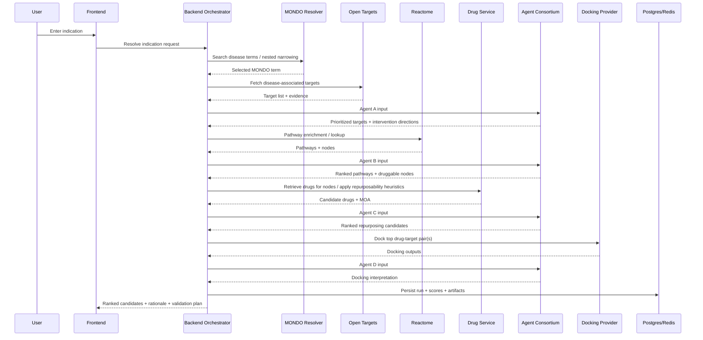

# YC Biohack Hackathon Plan — Indication-First Drug Repurposing Consortium

## 1) Objective

Build an indication-first drug repurposing system that:

1. Resolves a user-entered disease/indication into a precise ontology term.
2. Retrieves disease-associated genes/targets.
3. Expands those into pathway-level intervention opportunities.
4. Retrieves existing approved/off-patent drugs that modulate those pathway nodes.
5. Uses a consortium of reasoning agents only at the biological decision intersections.
6. Optionally validates top drug–target hypotheses with docking.
7. Produces a ranked shortlist of repurposable drugs for the input indication.

Core product thesis:

> Given an indication, identify the most plausible existing drugs to repurpose by reasoning over disease biology, pathways, mechanism of action, and structural plausibility.

---

## 2) Product Scope

### In scope

* Indication-first workflow
* MONDO-based disease narrowing
* Disease-associated target retrieval
* Pathway enrichment and pathway-neighbor expansion
* Drug retrieval over direct and pathway-adjacent nodes
* Off-patent / mature-drug filtering
* Agent consortium at biological intersections
* Docking for top shortlisted drug–target pairs
* Ranked output with rationale and recommended validation assays

### Out of scope for MVP

* Full global patent adjudication
* Massive all-drug screening
* Fully autonomous open-ended agent loops
* Wet-lab execution integration
* RFdiffusion in main workflow

### Pre-implementation decisions (must be locked before coding)

* Primary demo indication area (single disease family)
* Drug source(s) for MVP (and license/access constraints)
* Model provider strategy (single-model first vs multi-provider)
* Docking mode (live, cached, or disabled for default path)
* Minimum evaluation set (3-5 known drug-target sanity checks)

---

## 3) User Story

A user enters an indication such as:

* idiopathic pulmonary fibrosis
* ulcerative colitis
* glioblastoma

The system narrows it to a precise MONDO term, maps relevant genes/targets and pathways, identifies existing drugs that hit those mechanisms, and ranks repurposing candidates with biological reasoning and optional docking support.

---

## 4) High-Level Architecture

```mermaid
flowchart TD
    A[Frontend: Next.js / React] --> B[API Gateway / Backend Orchestrator]
    B --> C[MONDO Resolver]
    B --> D[Disease Target Service]
    B --> E[Pathway Service]
    B --> F[Drug Retrieval Service]
    B --> G[Agent Orchestrator]
    B --> H[Docking Service]
    B --> I[Results Store / Cache]

    C --> C1[MONDO / Monarch]
    D --> D1[Open Targets]
    E --> E1[Reactome]
    F --> F1[Drug DB + Status Heuristics]
    H --> H1[Docking Provider (DiffDock API or local)]

    G --> G1[Agent A: Disease Mechanism]
    G --> G2[Agent B: Pathway Prioritization]
    G --> G3[Agent C: Repurposing Ranker]
    G --> G4[Agent D: Docking Interpreter]

    I --> A
```

---

## 5) Agent Consortium Design

### Principle

Use agents only at the intersections where biological interpretation is needed. Retrieval stays deterministic.

### Why a consortium

A consortium is more defensible than a single monolithic model because each agent owns one reasoning problem and hands structured outputs to the next. This reduces hallucination, improves traceability, and makes the final result easier to explain.

### Agent roster

#### Agent A — Disease Mechanism Agent

**Input:**

* MONDO-resolved indication
* disease-associated genes/targets
* target–disease evidence scores

**Job:**

* separate likely drivers from passengers/biomarkers
* infer desired direction of modulation (inhibit / activate / modulate)
* produce prioritized disease intervention points

**Output schema:**

```json
{
  "disease": {"label": "idiopathic pulmonary fibrosis", "mondo_id": "MONDO:..."},
  "prioritized_targets": [
    {
      "gene": "TGFB1",
      "role": "core profibrotic signaling",
      "desired_modulation": "inhibit",
      "confidence": 0.92,
      "why": "Strong evidence across disease biology and pathway centrality"
    }
  ]
}
```

#### Agent B — Pathway Prioritization Agent

**Input:**

* prioritized targets from Agent A
* pathway enrichment results
* pathway membership / neighbors / upstream-downstream relationships

**Job:**

* identify the most disease-relevant pathways
* determine which nodes are actionable vs too downstream / too generic
* produce ranked druggable nodes

**Output schema:**

```json
{
  "ranked_pathways": [
    {
      "name": "Signaling by TGF-beta receptor complex",
      "source": "Reactome",
      "relevance_score": 0.94,
      "druggable_nodes": ["TGFBR1", "TGFBR2", "SMAD3"],
      "why": "Central to fibrotic remodeling"
    }
  ]
}
```

#### Agent C — Repurposing Ranker

**Input:**

* indication summary
* prioritized targets
* ranked pathways
* pathway nodes
* drug candidates
* drug target + action + known indications + off-patent status

**Job:**

* rank candidate drugs
* verify directionality fit between disease mechanism and drug action
* explain repurposing rationale
* surface risk flags and novelty

**Output schema:**

```json
{
  "candidates": [
    {
      "drug": "ExampleDrug",
      "target": "TGFBR1",
      "action": "inhibitor",
      "repurposing_score": 0.84,
      "novelty_score": 0.63,
      "risk_flags": ["Pathway pleiotropy"],
      "why": "Mechanistically aligned with profibrotic pathway inhibition"
    }
  ]
}
```

#### Agent D — Docking Interpreter

**Input:**

* selected drug–target pair(s)
* docking outputs
* disease/pathway context

**Job:**

* interpret docking as structural plausibility, not proof of efficacy
* downgrade or upgrade confidence
* summarize what can and cannot be concluded

**Output schema:**

```json
{
  "drug_target_pair": {"drug": "ExampleDrug", "target": "TGFBR1"},
  "structural_assessment": "supportive",
  "confidence_adjustment": 0.07,
  "limitations": ["Docking is not cellular validation"],
  "why": "Pose and confidence are directionally supportive"
}
```

### Consortium interaction protocol

1. Agent A produces disease intervention points.
2. Agent B critiques and expands them at the pathway layer.
3. Agent C consumes both and proposes ranked repurposing candidates.
4. Agent D updates the top candidate ranking using docking results.
5. A final summarizer composes the user-facing answer from structured outputs only.

### Multi-agent discussion pattern

Use a bounded two-round deliberation:

* Round 1: each agent independently produces JSON.
* Round 2: each agent sees the prior structured outputs and can revise only its own section.
* No free-form open-ended looping.

This preserves the “consortium” feel while keeping runtime and costs bounded.

---

## 6) Recommended Tech Stack (Implementation-Safe)

### Frontend

* **Next.js + React + TypeScript**
* **Tailwind CSS**
* **shadcn/ui** for polished components
* **Recharts** (or equivalent) for ranking visualizations

### Backend / API layer

* **Python FastAPI + Pydantic v2** for orchestration and data APIs
* Single backend service for MVP to keep contracts and tracing simple

### Async / workflow orchestration

* MVP default: synchronous pipeline + optional background docking job
* Job state in Redis (simple queue pattern); upgrade to dedicated workers only if latency requires it
* Optional scale path: Modal or equivalent for heavier docking/batch compute

### LLM / agent layer

* **Anthropic** is the required reasoning provider for MVP.
* Environment configuration:
  * `ANTHROPIC_API_KEY`
  * `ANTHROPIC_MODEL`
  * `ANTHROPIC_BASE_URL` (optional override)
* Start with one Anthropic model for all agents in MVP; add routing only if evaluation improves outcomes
* Strict JSON schema validation for every agent response (fail fast + one retry)

### Datastores

* **Postgres** for normalized metadata and results
* **Redis** for cache and transient job state
* **Object storage** for artifacts (docking JSON, poses, reports)

### Scientific / data sources

* **MONDO / Monarch** for disease ontology resolution
* **Open Targets GraphQL API** for target-disease associations
* **Reactome** for pathway enrichment/content
* Drug-target source must be locked in Phase 0 (recommended MVP baseline: ChEMBL + DrugCentral)
* Off-patent status treated as heuristic unless authoritative jurisdiction-specific data is integrated

### Docking / structural layer

* **Tamarind** docking API is the default structural provider (`TAMARIND_API_KEY`, `TAMARIND_BASE_URL`)
* DiffDock via other providers/local runner is optional fallback only
* Pipeline must succeed when docking is disabled (docking is additive evidence)
* Keep RFdiffusion as stretch, not core workflow

### Observability

* Structured logs for every stage
* Prompt/response capture for each agent
* Score breakdown traceability
* Per-stage latency + failure metrics

---

## 7) Systems Design Diagram



---

## 8) Data Flow

### Step 1: Disease resolution

* user enters free-text indication
* backend queries MONDO / Monarch
* frontend offers nested term refinement
* final output: canonical indication object

```json
{
  "user_query": "lung fibrosis",
  "resolved_term": {
    "label": "idiopathic pulmonary fibrosis",
    "mondo_id": "MONDO:...",
    "synonyms": ["IPF"],
    "parents": ["pulmonary fibrosis"]
  }
}
```

### Step 2: Disease target retrieval

* query Open Targets for target–disease associations
* normalize evidence scores and metadata
* pass top N targets to Agent A

### Step 3: Pathway expansion

* query Reactome using top targets
* get enriched pathways + member nodes
* pass top pathways and nodes to Agent B

### Step 4: Drug retrieval

* retrieve candidate drugs that hit direct targets or pathway-adjacent nodes
* filter to approved / public-data-rich / off-patent if possible
* pass curated candidates to Agent C

### Step 5: Docking

* run DiffDock on top K drug–target pairs
* pass docking output to Agent D

### Step 6: Final ranking

* combine:

  * disease-target evidence
  * pathway relevance
  * mechanism-direction fit
  * repurposability (approved / mature / off-patent heuristic)
  * docking support (if available)

---

## 9) Suggested Scoring Framework

Composite score for ranking repurposing candidates:

```text
Repurposing Score =
  0.30 * disease_target_relevance
+ 0.25 * pathway_intervention_fit
+ 0.20 * mechanism_directionality_fit
+ 0.15 * structural_plausibility
+ 0.10 * repurposability_score
```

Where:

* **disease_target_relevance** = evidence that the target matters in the disease
* **pathway_intervention_fit** = whether the node is a meaningful control point
* **mechanism_directionality_fit** = whether the drug’s action matches desired modulation
* **structural_plausibility** = docking support if run
* **repurposability_score** = off-patent / approved / public-data-rich / known safety profile

If docking is disabled or unavailable, re-normalize weights across the remaining terms so candidates are not penalized for missing structural data.

---

## 10) API Design

### Backend endpoints (MVP)

#### `POST /resolve-indication`

Input:

```json
{"query": "lung fibrosis"}
```

Output:

```json
{
  "matches": [
    {"label": "pulmonary fibrosis", "mondo_id": "MONDO:..."},
    {"label": "idiopathic pulmonary fibrosis", "mondo_id": "MONDO:..."}
  ]
}
```

#### `POST /runs`

Creates and starts a full ranking run.

Input:

```json
{"mondo_id": "MONDO:...", "top_k": 20, "enable_docking": false}
```

Output:

```json
{
  "run_id": "run_123",
  "status": "running"
}
```

#### `GET /runs/{run_id}`

Returns run status and partial/final outputs.

Output:

```json
{
  "run_id": "run_123",
  "status": "completed",
  "stage": "finalized",
  "candidates": [...],
  "score_breakdown": [...]
}
```

#### `POST /runs/{run_id}/dock`

Optionally trigger docking on top candidate pairs after base ranking.

Input:

```json
{"pairs": [{"drug": "ExampleDrug", "target": "TGFBR1"}]}
```

Output:

```json
{
  "run_id": "run_123",
  "status": "docking_running"
}
```

#### `GET /runs/{run_id}/report`

Returns user-facing explanation payload.

Output:

```json
{
  "summary": "...",
  "top_candidates": [...],
  "limitations": [...]
}
```

Implementation notes:

* Long-running operations are run-scoped with explicit status transitions (`queued`, `running`, `completed`, `failed`, `partial`)
* All responses include traceable stage-level errors rather than failing silently

---

## 11) Data Model

### Table: `disease_runs`

* `id`
* `user_query`
* `mondo_id`
* `disease_label`
* `status`
* `current_stage`
* `error_json`
* `created_at`
* `updated_at`

### Table: `targets`

* `id`
* `run_id`
* `gene_symbol`
* `source`
* `evidence_score`
* `desired_modulation`
* `agent_priority_score`
* `notes`

### Table: `pathways`

* `id`
* `run_id`
* `pathway_name`
* `source`
* `relevance_score`
* `druggable_nodes_json`
* `notes`

### Table: `candidate_drugs`

* `id`
* `run_id`
* `drug_name`
* `target`
* `action_type`
* `approved_status`
* `off_patent_flag`
* `known_indications_json`
* `repurposing_score`
* `score_breakdown_json`
* `rationale`
* `confidence_note`

### Table: `docking_jobs`

* `id`
* `run_id`
* `drug_name`
* `target`
* `job_status`
* `provider`
* `confidence`
* `artifact_url`
* `interpretation_json`

### Table: `run_events`

* `id`
* `run_id`
* `stage`
* `status`
* `message`
* `payload_json`
* `created_at`

---

## 12) Prompting Strategy

### Shared rules

* Every agent receives structured JSON inputs only.
* Every agent must return valid JSON matching its schema.
* Agents must separate “evidence-backed” from “hypothesis.”
* Agents must explicitly include uncertainty.

### Agent A prompt skeleton

```text
You are the Disease Mechanism Agent.
Given a resolved indication and disease-associated targets, identify the most likely intervention points.
Do not merely restate association scores.
Return only JSON.
```

### Agent B prompt skeleton

```text
You are the Pathway Prioritization Agent.
Given prioritized targets and pathway results, rank the pathways and identify the most actionable druggable nodes.
Prefer upstream or control-point nodes over generic downstream readouts.
Return only JSON.
```

### Agent C prompt skeleton

```text
You are the Drug Repurposing Agent.
Given the indication, disease intervention points, pathways, and candidate drugs, rank drugs for repurposing.
You must reason about directionality: whether the drug action aligns with the desired biological modulation.
Return only JSON.
```

### Agent D prompt skeleton

```text
You are the Docking Interpreter Agent.
Given docking outputs and biological context, assess whether the structural result is supportive, neutral, or contradictory.
Do not claim efficacy.
Return only JSON.
```

---

## 13) Execution Plan

### Phase -1 — Day 0 bootstrap (current repo is docs-only)

* Scaffold `apps/web` (Next.js) and `apps/api` (FastAPI)
* Add `docker-compose.yml` for Postgres + Redis
* Add `.env.example` with all required keys
* Add lint/test scripts and CI baseline

Exit criteria:

* Both apps boot locally
* Health endpoint works (`GET /health`)
* One command runs lint+tests in CI

### Phase 0 — Scope lock

* Pick one disease area for the demo
* Choose 1-3 example indications
* Lock drug DB + off-patent heuristic source
* Decide docking mode for demo path (`off` by default, optional `on`)
* Freeze JSON schemas for Agent A/B/C/D I/O

Exit criteria:

* Scope decisions documented in `docs/scope.md`
* Input/output schemas committed in `packages/shared-types`

### Phase 1 — Skeleton app + indication resolution

* Implement `POST /resolve-indication`
* Build MONDO narrowing UI flow
* Implement run creation + status polling (`POST /runs`, `GET /runs/{id}`)

Exit criteria:

* User can resolve a query to a MONDO term from UI
* Run record persists to Postgres

### Phase 2 — Disease and pathway pipeline

* Integrate Open Targets target-disease retrieval
* Integrate Reactome pathway lookup/enrichment
* Normalize and persist target/pathway payloads

Exit criteria:

* For a fixed indication, pipeline produces deterministic target/pathway JSON
* Cached reruns are significantly faster than cold runs

### Phase 3 — Agent consortium

* Implement Agent A/B/C/D wrappers
* Add strict schema validation with retry-once logic
* Implement bounded two-round consortium flow
* Log prompt and model output artifacts

Exit criteria:

* Agent outputs always parse and validate
* Failed agent calls surface explicit stage errors

### Phase 4 — Drug retrieval + scoring

* Build drug retrieval service for direct + pathway-adjacent nodes
* Apply repurposability heuristic (approved/mature/off-patent signal)
* Implement composite score calculation
* Render ranked candidate cards in UI

Exit criteria:

* UI displays top N candidates with score breakdown
* Score formula and features are fully traceable per candidate

### Phase 5 — Optional docking integration

* Add DiffDock provider wrapper
* Persist docking jobs/artifacts
* Feed docking outcomes to Agent D and confidence adjustment

Exit criteria:

* Base ranking works with docking disabled
* Docking-enabled run updates confidence without breaking pipeline

### Phase 6 — Demo polish

* Add progress states and failure messaging
* Add "why this drug" and "next validation assay" sections
* Precompute 1-2 reliable demo examples

Exit criteria:

* End-to-end demo completes in predictable time
* Narrative is reproducible across prepared indications

---

## 14) Suggested Repo Structure

```text
.
  apps/
    web/                  # Next.js app
    api/                  # FastAPI app
  packages/
    shared-types/         # Pydantic/TS shared contracts
    prompts/              # Prompt templates + versions
    scoring/              # Ranking logic
  services/
    mondo/
    open_targets/
    reactome/
    drugs/
    docking/
    agents/
  scripts/
    seed_data/
    preload_examples/
  infra/
    docker-compose.yml
  docs/
    architecture.md
    prompts.md
    api_contracts.md
    scope.md
  Plan.md
  README.md
```

---

## 15) Demo Walkthrough

1. User types “lung fibrosis”.
2. App narrows to “idiopathic pulmonary fibrosis”.
3. Show top disease targets with intervention directions.
4. Show top enriched pathways and why they matter.
5. Show ranked repurposable drugs with mechanism cards.
6. Click one candidate to show docking-backed structural plausibility.
7. End with recommended validation assays.

This tells a complete story from disease to experiment.

---

## 16) Risks and Mitigations

### Risk: agents hallucinate biology

**Mitigation:** retrieval is deterministic; agents only reason on retrieved JSON.

### Risk: docking is overinterpreted

**Mitigation:** Agent D explicitly frames docking as plausibility, not proof.

### Risk: patent/off-patent status is noisy

**Mitigation:** keep “repurposable / mature / public-data-rich” as fallback language if exact off-patent resolution is incomplete.

### Risk: runtime too slow

**Mitigation:** cache MONDO, Open Targets, Reactome, and some docking outputs.

### Risk: too many candidates

**Mitigation:** cap candidates early and keep top N only.

### Risk: output interpreted as treatment advice

**Mitigation:** add explicit research-use-only disclaimer in UI and report payloads; include limitations section by default.

---

## 17) Recommended Final Scope for the Hackathon

### Must-have

* indication input
* MONDO narrowing
* disease target retrieval
* pathway prioritization
* candidate drug ranking
* consortium reasoning
* polished UI

### Nice-to-have

* live docking for top 1–2 candidates
* downloadable report
* alternative disease branches

### Stretch

* literature evidence grounding
* interactive network graph
* RFdiffusion “next-step” extension

---

## 18) Final Pitch

> We built an indication-first repurposing system that resolves a disease precisely, maps its targets and pathways, and uses a consortium of reasoning agents to identify existing drugs worth repurposing, with optional structural validation on top candidates.

---

## 19) Immediate Next Steps

1. Complete Phase -1 bootstrap (scaffold `apps/web`, `apps/api`, and local Postgres/Redis).
2. Lock disease area, example indications, and drug data sources in `docs/scope.md`.
3. Implement `POST /resolve-indication` and UI narrowing flow.
4. Implement run lifecycle endpoints (`POST /runs`, `GET /runs/{id}`).
5. Wire Open Targets + Reactome and persist normalized outputs.
6. Implement Agent A/B/C with strict JSON contracts and retries.
7. Add scoring + ranked candidate UI.
8. Integrate optional docking and finalize the demo narrative.
