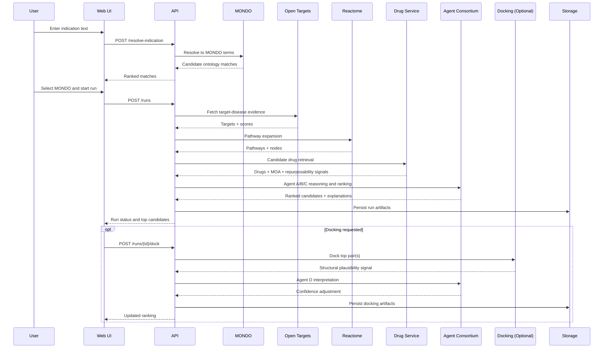

# Systems Design Diagram

## Component Architecture

```mermaid
flowchart LR
    U[User Browser] --> WEB[Next.js Web App]
    WEB --> API[FastAPI Orchestrator]

    API --> MONDO[MONDO Resolver Service]
    API --> OT[Open Targets Service]
    API --> REACTOME[Reactome Service]
    API --> DRUGS[Drug Retrieval Service]
    API --> AGENTS[Agent Consortium]
    API --> DOCK[Docking Service (Optional)]

    API --> PG[(Postgres)]
    API --> REDIS[(Redis Cache/Jobs)]
    API --> OBJ[(Artifact Storage)]

    AGENTS --> LLM[LLM Provider]
    DOCK --> OBJ
```

## Runtime Sequence


